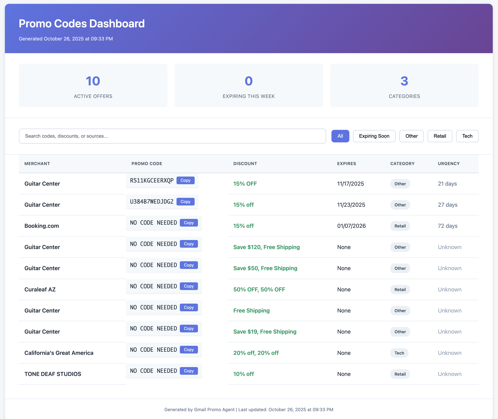
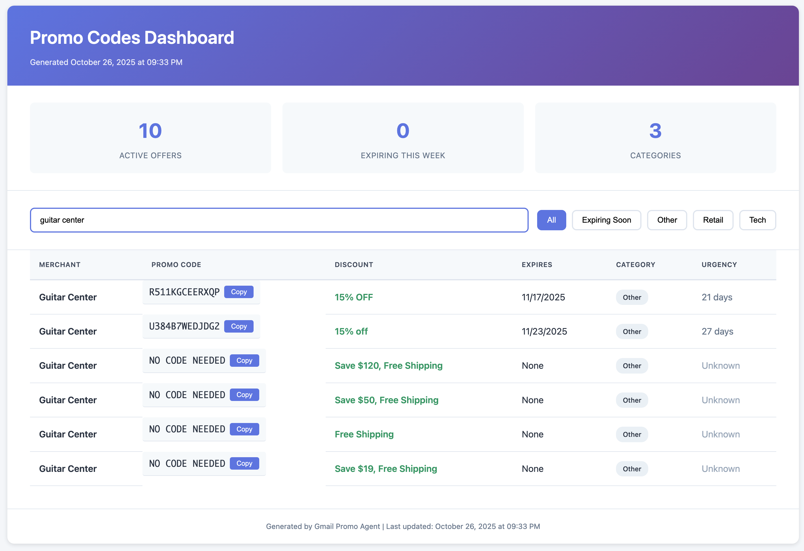
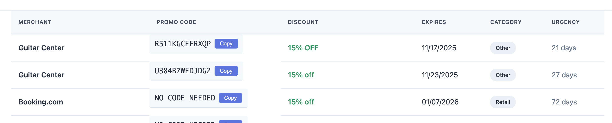

# How I Built a Gmail Promo Agent with Claude in One Day

## The Problem

I was drowning in promotional emails. Over the years, I've subscribed to countless mailing lists—airlines, restaurants, retailers, concert venues, tech newsletters. My inbox is full of offers, but when I actually need a promo code, I spend 10 minutes clicking through dozens of emails trying to remember which store sent what deal.

I'd think "didn't Target send me a discount code last week?" and then waste time searching through my promotions folder. By the time I found it, the code had usually expired.

I wanted something simple: a tool that could scan my Gmail, pull out all the promo codes, and put them in one place where I could actually find them. But I wasn't willing to hand over my Gmail credentials to some random web app. I needed something that ran locally on my computer and kept my data private.

So I built it. With Claude's help, I went from idea to working tool in one day.

## What I Built

The Gmail Promo Agent is a local tool that connects to your Gmail, scans promotional emails, extracts promo codes, and generates a searchable dashboard.

It connects securely to Gmail via OAuth (you control the access), scans promotional emails and pulls out promo codes, auto-categorizes offers into Flights, Food, Retail, Entertainment, tracks expiration dates so you don't miss deals, and generates an interactive HTML dashboard with search and filters. The whole thing runs on your computer—no cloud processing, no third-party access.

I used Python, FastAPI, SQLite, the Gmail API, and basic HTML/JavaScript for the dashboard.

The entire thing runs locally. Your emails never leave your machine. No external servers, no subscriptions, no handing over credentials to anyone.

## The Results

What used to take 10 minutes of frustrated inbox searching now takes 2 seconds. Here's what the dashboard looks like:

### Main Dashboard View

*The dashboard shows 10 active offers across 3 categories with one-click copy buttons for each code*

### Search in Action

*Type "guitar center" to instantly filter and see all 6 available codes from that merchant*

### Expiration Tracking

*Each code displays urgency in days (21 days, 27 days, 72 days) so you never miss an expiring deal*

**Real impact:**
- **Time saved:** About 20 hours per year (10 min/week × 52 weeks → 2 seconds)
- **Deals captured:** I caught 8 expiring codes in the first month that I would have completely missed
- **Privacy maintained:** Full control over my data—nothing leaves my machine

## Try It Yourself

The code is on GitHub: [github.com/udirno/gmail-promo-agent](https://github.com/udirno/gmail-promo-agent)

If you want to set it up:

Clone the repository and install dependencies:
```bash
git clone https://github.com/udirno/gmail-promo-agent.git
cd gmail-promo-agent
pip install -r requirements.txt
```

Set up Gmail API access. Go to [Google Cloud Console](https://console.cloud.google.com), create a project, enable Gmail API, and download OAuth credentials as `credentials.json`.

Run the agent:
```bash
python main.py
```

The dashboard will open automatically at `http://localhost:8000`, or you can open `dashboard.html` directly in your browser.

First time you run it, you'll authenticate via browser. The credentials get stored locally in `token.pickle` so you only need to do it once.

## How I Built It with Claude

I'm not a software engineer. I'm trying to keep up in the age of AI like everyone else. But I wanted to test whether publicly available AI tools could help me solve a real problem in my daily life.

Here's the exact process I followed. If you're non-technical like me, you can use this same approach for your own projects.

### Step 1: Figure Out What I Actually Needed

I started by describing the problem to Claude in plain language:

```
I want to build a tool that scans my Gmail promotions, 
extracts promo codes, and creates a searchable dashboard. 
It needs to run locally and respect my privacy. Help me plan this.
```

Claude helped me break it down into pieces I could understand:
1. Gmail API OAuth setup (secure, local authentication)
2. Email parsing and promo code extraction
3. Categorization system
4. Local database (SQLite)
5. Dashboard generation

I didn't need to know how to do any of this myself. I just needed to understand what needed to happen.

### Step 2: Gmail API Setup

This was the part I was most worried about. I've never worked with Google's APIs before.

**What I asked Claude:**
> "Walk me through setting up Gmail API OAuth for a local Python app. I want to authenticate once and store credentials securely."

Claude provided step-by-step OAuth 2.0 setup instructions (in plain English), Python code for the authentication flow, how to store and refresh tokens securely, and error handling for when credentials expire.

Claude generated the files and explained what each one did: `gmail_auth.py` for OAuth flow and credential management, and `config.yaml` for configuration.

```python
# Example OAuth flow Claude helped me implement
def authenticate_gmail():
    creds = None
    if os.path.exists('token.pickle'):
        with open('token.pickle', 'rb') as token:
            creds = pickle.load(token)
    
    if not creds or not creds.valid:
        # Trigger OAuth flow...
```

I didn't write this code myself—Claude did. But I understood what it was doing, which was enough.

### Step 3: Extracting Promo Codes

The hardest part was making sure the tool only extracted real promo codes, not random capitalized words from emails.

**What I asked Claude:**
> "Help me build a regex pattern that extracts promo codes from emails. It should only match codes that appear near phrases like 'use code' or 'enter code', not random capitalized words."

Claude used context-aware pattern matching, conservative extraction (quality over quantity), discount amount parsing, and expiration date detection.

Here are the patterns we used:
```python
# Pattern matches "Use code SAVE20" or "Enter FLIGHT40 at checkout"
PROMO_PATTERN = r'(?:use|enter|code:?)\s+([A-Z0-9]{4,12})\b'
DISCOUNT_PATTERN = r'(\d{1,2}%\s+off|\$\d{1,3}\s+off)'
EXPIRY_PATTERN = r'(?:expires?|valid until):?\s+(\d{1,2}/\d{1,2}(?:/\d{2,4})?)'
```

We had to iterate on this a few times. The first version grabbed too many false positives—random strings that looked like codes but weren't. We refined it until it was conservative and accurate.

### Step 4: Auto-Categorization

I wanted the tool to automatically sort codes into categories like Flights, Food, Retail, etc.

**What I asked Claude:**
> "I want to categorize promos into Flights, Food, Retail, and Entertainment. How should I approach this?"

Claude suggested keyword-based categorization with a JSON config file, with a fallback to checking the sender's email domain, and an "Other" category for anything that doesn't match.

This made sense. I created a `categories.json` file with keywords:
```json
{
  "Flights": ["flight", "airline", "fare", "travel", "airways"],
  "Food": ["restaurant", "pizza", "meal", "delivery", "dine"],
  "Retail": ["store", "shop", "clothing", "apparel", "sale"],
  "Entertainment": ["concert", "movie", "show", "event", "ticket"]
}
```

The tool checks each email against these keywords and assigns a category. Simple and effective.

### Step 5: Building the Dashboard

I wanted a dashboard where I could search for any merchant and instantly see all their codes.

**What I asked Claude:**
> "Generate an HTML dashboard that displays promo codes in a table with search, filters, and one-click copying. It needs to work offline."

Claude created a self-contained HTML file with embedded CSS and JavaScript. It has real-time search across all fields, category filters, sortable columns, copy-to-clipboard buttons, mobile-responsive design, and zero external dependencies so it works offline.

The dashboard has a search bar where you can type any merchant name or keyword, category pills you can click to filter, urgency indicators showing days until expiration, and one-click copying for each code.

### Step 6: Putting It All Together

Claude helped me write a main.py that orchestrated everything: authenticate, fetch emails, parse promos, store in database, and generate the dashboard.

The final structure looked like this:

```
gmail_promo_agent/
├── gmail_auth.py          # OAuth authentication
├── promo_parser.py        # Code extraction logic
├── categorizer.py         # Auto-categorization
├── database.py            # SQLite storage
├── dashboard_generator.py # HTML creation
├── main.py                # Orchestration
└── config.yaml            # Settings
```

Claude provided a FastAPI application with a command-line interface, incremental updates (only process new emails), error handling and logging, and progress indicators.

I ran it, it worked, and I had a functional tool.

## What I Learned

**Start with the problem, not the tech.** I didn't need to know FastAPI, SQLite, or regex patterns before starting. I just needed to clearly describe the problem I wanted to solve. Claude helped translate that into technical requirements.

**You'll need to iterate.** The first version of the promo extraction had too many false positives. We refined it three times. Don't expect perfection on the first try.

**Ask for explanations, not just code.** Instead of "write me a function," I asked "explain how OAuth works for Gmail and then help me implement it." This helped me understand what I was building, even if I wasn't writing the code myself.

**Local-first tools are actually simpler.** You don't need cloud processing for something like this. Running locally is easier, more private, and completely viable for personal tools.

**AI helps, but you still need to understand.** I made all the important decisions about architecture, privacy, and features. Claude was like a knowledgeable assistant who handled the implementation details. I still needed to understand what was happening.

## What's Next

This project shows that AI can help non-technical people build practical tools quickly. You don't need a computer science degree. You just need a problem worth solving and the willingness to iterate until it works.

I'm thinking about adding a browser extension for quicker access, maybe a mobile app with notifications for expiring codes, and possibly support for other email providers like Outlook or Yahoo. Integration with price tracking services could be interesting too.

You could use this same approach to build other things: a receipt organizer for expense tracking, an event aggregator that pulls all your tickets and reservations, a newsletter summarizer, or a follow-up reminder system. The code is open source, so you can audit it, modify it, or use it as a starting point for your own projects.

## Conclusion

From idea to working tool in one day. From 10 minutes of inbox frustration to 2 seconds of search. From worrying about privacy to having full control.

AI-assisted development isn't about replacing technical skills. It's about making it possible for more people to solve their own problems without needing years of programming experience.

The idea behind this project is to show that AI can help ordinary people speed up ordinary processes in their lives without needing deep technical knowledge—just by using AI thoughtfully.

I built something simple, useful, and modern that works for me. Maybe it'll work for you too.

*Built with Claude • 100% Local • Privacy-First • Open Source*

**Questions or improvements?** Open an issue on [GitHub](https://github.com/udirno/gmail-promo-agent)
